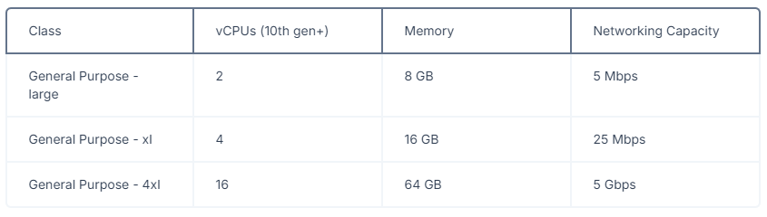

# CHAINBASE NODE OPERATOR SETUP

## SPEC



## SETUP OPERATOR STEP BY STEP
1. Install Dependency
   ```bash
    sudo apt update & sudo apt upgrade -y
    sudo apt install ca-certificates zlib1g-dev libncurses5-dev libgdbm-dev libnss3-dev curl git wget make jq build-essential pkg-config lsb-release libssl-dev libreadline-dev libffi-dev gcc screen unzip lz4 -y
   ```
2. Install Docker (if you don't have it) -> check it first using `docker-compose --version` or `docker compose --version`
   ```bash
    sudo apt install docker.io
    sudo curl -L "https://github.com/docker/compose/releases/download/1.29.2/docker-compose-$(uname -s)-$(uname -m)" -o /usr/local/bin/docker-compose
    docker-compose --version
   ```
3. Install Go (if you don't have it) -> check it first using `go version`
   ```bash
    sudo rm -rf /usr/local/go
    curl -L https://go.dev/dl/go1.22.4.linux-amd64.tar.gz | sudo tar -xzf - -C /usr/local
    echo 'export PATH=$PATH:/usr/local/go/bin:$HOME/go/bin' >> $HOME/.bash_profile
    echo 'export PATH=$PATH:$(go env GOPATH)/bin' >> $HOME/.bash_profile
    source .bash_profile
    go version
   ```
4. Install Eigen Layer CLI
   ```bash
    curl -sSfL https://raw.githubusercontent.com/layr-labs/eigenlayer-cli/master/scripts/install.sh | sh -s
    export PATH=$PATH:~/bin
    eigenlayer --version
   ```
5. Clone Chainbase AVS repo
   ```bash
    git clone https://github.com/chainbase-labs/chainbase-avs-setup

    cd chainbase-avs-setup/holesky
   ```
6. Create / Import EigenLayer Wallet
   - To Create Wallet Use
   ```bash
   eigenlayer operator keys create --key-type ecdsa opr
   ```
     - Enter Password
     - Back Up The Wallet Private Key (file : `/root/.eigenlayer/operator_keys/opr.ecdsa.key.json`)
     - Press `ctrl+c+enter` to exit from create wallet process
   - To Import Wallet Use
   ```
   eigenlayer operator keys import --key-type ecdsa opr PRIVATEKEY
   ```
   - To Export EVM WALLET
   ```bash
   eigenlayer operator keys export -k ecdsa -p /root/.eigenlayer/operator_keys/opr.ecdsa.key.json
   ```
7. Configure and register Operator **(NEED 1 HOLESKY ETH FOR OPERATOR REGISTRATION FEE)**
   ```bash
   eigenlayer operator config create
   ```
   fill up the prompt with : 
   - operator address: Your Eigenlayer ETH address
   - earnings address: press Enter
   - ETH rpc url: https://ethereum-holesky-rpc.publicnode.com
   - network: holesky
   - signer type: local_keystore
   - ecdsa key path:: /root/.eigenlayer/operator_keys/opr.ecdsa.key.json
8. Configure metadata.json
   ```bash
   nano metadata.json
   ```
   fill up the details like this example, remember this just example, change something that need to change
   ```json
    {
        "name": "YOUR MONIKER / NAME",
        "website": "WEBSITE URL / GITHUB URL",
        "description": "ANY DESCRIPTION",
        "logo": "ANY PNG WITH MAX SIZE 1 MB",
        "twitter": "YOUR TWITTER URL"
    }
   ```
   now copy all data inside metadata.json and save with `ctrl+x` press `y` and press `enter`. and follow this step :
   - create github repository.
   - create file `metadata.json` and paste metadata.json from step before.
   - optional you can also upload your logo here and change your metadata logo with your logo url from github
9.  Configure operator.yml
    ```bash
    nano operator.yml
    ```
    - find for `metadata_url:`.
    - fill up with your metadata.json raw url from github.
    - save with `ctrl+x` press `y` and press `enter`.
10. Run The Operator
    ```bash
    eigenlayer operator register operator.yaml
    ```
11. Check The Operator Status
    ```bash
    eigenlayer operator status operator.yaml
    ```
12. Configure AVS
    ```bash
    rm -rf .env
    nano .env
    ```
    - paste this
    ```
    # Chainbase AVS Image
    MAIN_SERVICE_IMAGE=repository.chainbase.com/network/chainbase-node:testnet-v0.1.7
    FLINK_TASKMANAGER_IMAGE=flink:latest
    FLINK_JOBMANAGER_IMAGE=flink:latest
    PROMETHEUS_IMAGE=prom/prometheus:latest

    MAIN_SERVICE_NAME=chainbase-node
    FLINK_TASKMANAGER_NAME=flink-taskmanager
    FLINK_JOBMANAGER_NAME=flink-jobmanager
    PROMETHEUS_NAME=prometheus

    # FLINK CONFIG
    FLINK_CONNECT_ADDRESS=flink-jobmanager
    FLINK_JOBMANAGER_PORT=8081
    NODE_PROMETHEUS_PORT=9091
    PROMETHEUS_CONFIG_PATH=./prometheus.yml

    # Chainbase AVS mounted locations
    NODE_APP_PORT=8080
    NODE_ECDSA_KEY_FILE=/app/operator_keys/ecdsa_key.json
    NODE_LOG_DIR=/app/logs

    # Node logs configs
    NODE_LOG_LEVEL=debug
    NODE_LOG_FORMAT=text

    # Metrics specific configs
    NODE_ENABLE_METRICS=true
    NODE_METRICS_PORT=9092

    # holesky smart contracts
    AVS_CONTRACT_ADDRESS=0x5E78eFF26480A75E06cCdABe88Eb522D4D8e1C9d
    AVS_DIR_CONTRACT_ADDRESS=0x055733000064333CaDDbC92763c58BF0192fFeBf

    ###############################################################################
    ####### TODO: Operators please update below values for your node ##############
    ###############################################################################
    # TODO: Operators need to point this to a working chain rpc
    NODE_CHAIN_RPC=https://rpc.ankr.com/eth_holesky
    NODE_CHAIN_ID=17000

    # TODO: Operators need to update this to their own paths
    USER_HOME=$HOME
    EIGENLAYER_HOME=${USER_HOME}/.eigenlayer
    CHAINBASE_AVS_HOME=${EIGENLAYER_HOME}/chainbase/holesky

    NODE_LOG_PATH_HOST=${CHAINBASE_AVS_HOME}/logs

    # TODO: Operators need to update this to their own keys
    NODE_ECDSA_KEY_FILE_HOST=${EIGENLAYER_HOME}/operator_keys/opr.ecdsa.key.json

    # TODO: Operators need to add password to decrypt the above keys
    # If you have some special characters in password, make sure to use single quotes
    NODE_ECDSA_KEY_PASSWORD=YOURWALLETPASSWORD
    ```
    - modify the `YOURWALLETPASSWORD` with your wallet password before
13. Modify Docker Compose
    ```bash
    rm docker-compose.yml
    nano docker-compose.yml
    ```
    - Paste this
    ```docker
    services: 
    prometheus: 
        image: ${PROMETHEUS_IMAGE} 
        container_name: ${PROMETHEUS_NAME} 
        env_file: 
        - .env 
        volumes: 
        - "${PROMETHEUS_CONFIG_PATH}:/etc/prometheus/prometheus.yml" 
        command:  
        - "--enable-feature=expand-external-labels" 
        - "--config.file=/etc/prometheus/prometheus.yml" 
        ports: 
        - "${NODE_PROMETHEUS_PORT}:9090" 
        networks: 
        - chainbase 
        restart: unless-stopped 
    
    flink-jobmanager: 
        image: ${FLINK_JOBMANAGER_IMAGE} 
        container_name: ${FLINK_JOBMANAGER_NAME} 
        env_file: 
        - .env 
        command: jobmanager 
        networks: 
        - chainbase 
        restart: unless-stopped 
    
    flink-taskmanager: 
        image: ${FLINK_JOBMANAGER_IMAGE} 
        container_name: ${FLINK_TASKMANAGER_NAME} 
        env_file: 
        - .env 
        depends_on: 
        - flink-jobmanager 
        command: taskmanager 
        networks: 
        - chainbase 
        restart: unless-stopped 
    
    chainbase-node: 
        image: ${MAIN_SERVICE_IMAGE} 
        container_name: ${MAIN_SERVICE_NAME} 
        command: ["run"] 
        env_file: 
        - .env 
        ports: 
        - "${NODE_APP_PORT}:${NODE_APP_PORT}" 
        - "${NODE_METRICS_PORT}:${NODE_METRICS_PORT}" 
        volumes: 
        - "${NODE_ECDSA_KEY_FILE_HOST:-./opr.ecdsa.key.json}:${NODE_ECDSA_KEY_FILE}" 
        - "${NODE_LOG_PATH_HOST}:${NODE_LOG_DIR}:rw" 
        depends_on: 
        - prometheus 
        - flink-jobmanager 
        - flink-taskmanager 
        networks: 
        - chainbase 
        restart: unless-stopped 
    
    networks: 
    chainbase: 
        driver: bridge
    ```
    - Create folder for docker
    ```
    source .env && mkdir -pv ${EIGENLAYER_HOME} ${CHAINBASE_AVS_HOME} ${NODE_LOG_PATH_HOST} && chmod +x ./chainbase-avs.sh
    ```
14. Configure Phrometheus
    ```bash
    nano prometheus.yml
    ```
    - Replace operator with your operator address (EVM).
    - save with `ctrl+x` press `y` and press `enter`.
15. Run The Chainbase AVS
    ```bash
    ./chainbase-avs.sh register && ./chainbase-avs.sh run
    ```
16. Check Log 
    ```bash
    docker compose logs chainbase-node -f
    ```